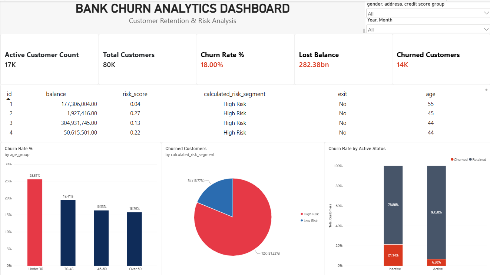

# 🏦 VietNam Bank Churn Analytics & Retention Strategy

## 📌 1. Project Context & Objectives

### Bối cảnh Business
Ngân hàng ghi nhận tỷ lệ khách hàng ngưng sử dụng dịch vụ (`exit = 'Yes'`) có xu hướng gia tăng, chạm mốc **18.00%**, gây thất thoát nguồn vốn tài sản ròng lớn (**$282.38M Lost Balance**). 

Việc thiếu một hệ thống theo dõi rủi ro tập trung khiến bộ phận Quản trị Quyền lợi Khách hàng (*Customer Retention*) bị động, chỉ phát hiện khi khách hàng đã đóng tài khoản hoặc rút toàn bộ tiền gửi.

### Mục tiêu Dự án
- **Xác định chân dung khách hàng:** Nhận diện nhóm khách hàng có rủi ro rời bỏ cao nhất dựa trên độ tuổi, số dư, số lượng sản phẩm và trạng thái hoạt động.
- **Đo lường tác động tài chính:** Tóm tắt tổng giá trị tài sản ròng bị thất thoát do Churn.
- **Đề xuất Chiến lược giữ chân (Customer Retention):** Đưa ra 4 chiến lược hành động dựa trên dữ liệu giúp giảm Churn Rate từ **18.00% xuống < 12.00%** và bảo vệ tối thiểu **$94M+** tài sản ròng.

### Bộ câu hỏi cốt lõi (Core Business Questions)
1. Tỷ lệ Churn Rate tổng thể của ngân hàng hiện tại là bao nhiêu?
2. Độ tuổi (`age_group`), số lượng sản phẩm (`nums_service`), và trạng thái hoạt động (`active_member`) ảnh hưởng như thế nào đến rủi ro rời bỏ?
3. Nhóm khách hàng có số dư cao (`High Balance`) rời bỏ tập trung ở phân khúc nào?

---

## 🛠️ 2. Tech Stack & Architecture

**Data Pipeline Flow:**  
`[Raw Data]` ➔ `[SQL Server / Data Warehouse]` ➔ `[Python ETL Ingestion]` ➔ `[Power BI & Google Sheets]`

- **Database & Warehousing:** SQL Server (Data Lake, Staging, DWH Views)
- **ETL & Data Processing:** Python (`pandas`, `sqlalchemy`), SQL Analytics Queries
- **Visualization & Modeling:** Power BI Desktop (DAX, Data Modeling, Git LFS integration), Google Sheets (What-If Model)
- **Version Control:** Git, Git LFS (Tracking `.pbix` binary files)

---

## 🎯 3. Success Criteria & Key Deliverables

### Key Results & Impact
- **Top 3 Yếu tố Churn hàng đầu:** Khách hàng thụ động (`Inactive Members` - Churn 21.14%), Phân khúc tiệm cận hưu trí (40–60 tuổi), và Khách hàng trẻ Under 30 (Churn 25.51%).
- **Tác động Dự báo:** Kế hoạch hành động giúp bảo vệ **~$94.1M+** tài sản ròng bị rò rỉ.

### Project Deliverables
- 📁 **`sql/`**: Bộ 4 SQL scripts khởi tạo Data Lake, Data Warehouse, ETL pipeline và Analytical Queries.
- 📁 **`docs/`**: Bộ tài liệu kỹ thuật chuẩn mực bao gồm:
  - [`data_dictionary.md`](docs/data_dictionary.md): Từ điển dữ liệu giải thích 31 trường thông tin.
  - [`project_scope.md`](docs/project_scope.md): Định nghĩa phạm vi In-Scope / Out-of-Scope & Kiến trúc End-to-End.
  - [`actionable_recommendation.md`](docs/actionable_recommendation.md): Chi tiết 4 chiến lược Retention.
- 📁 **`reports/`**: 
  - [`executive_summary.md`](reports/executive_summary.md): Báo cáo tóm tắt C-Level & Link mô hình Google Sheets.
  - `Bank Churn Analytics Dashboard.pbix`: Interactive Power BI Dashboard.
  - File Excel Offline Pivot Summary & What-If Financial Model.
- 📁 **`src/` & `notebooks/`**: Mã nguồn Python thiết lập kết nối Database và Ingestion pipeline.

---

## 🚀 4. How to Reproduce (Getting Started)

1. **Clone Repository & Pull LFS Files:**
   - Run: `git clone https://github.com/Pham-Minh-Duc/VietNam_Bank_Churn.git`
   - Run: `cd VietNam_Bank_Churn`
   - Run: `git lfs pull`

2. **Database Setup:**
   - Chạy các file SQL trong thư mục `sql/` theo đúng thứ tự (`01_init` ➔ `02_staging` ➔ `03_dwh` ➔ `04_analytics`).

3. **Open Report:**
   - Yêu cầu **Power BI Desktop** (Bản mới nhất) để mở file `reports/Bank Churn Analytics Dashboard.pbix`.

---

## 🔗 Quick Access & Interactive Resources
- 📊 **Live Financial & Pivot Model (Google Sheets):** [View Live Dashboard](https://docs.google.com/spreadsheets/d/1F1jtjFdicCSO-IEV_Mwm4GL5nalJ68-FpJ1Y-bmoWq4/edit?hl=vi&gid=1736678425#gid=1736678425)
- 📋 **Executive Summary Report:** [Read Full Report](reports/executive_summary.md)